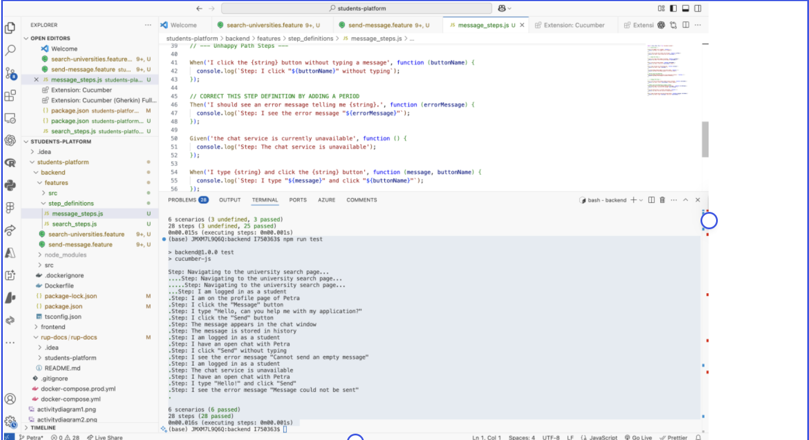

# 📑 ISC Master Test Plan (RUP Template)


---

## Table of Contents
1. [Introduction](#introduction)
   - [Purpose](#purpose)
   - [Scope](#scope)
   - [Terminology and Acronyms](#terminology-and-acronyms)
2. [Evaluation Mission and Test Motivation](#evaluation-mission-and-test-motivation)
   - [Evaluation Mission](#evaluation-mission)
   - [Test Motivators](#test-motivators)
3. [Target Test Items](#target-test-items)
4. [Outline of Planned Tests](#outline-of-planned-tests)
   - [Outline of Test Inclusions](#outline-of-test-inclusions)
5. [Test Approach](#test-approach)
   - [Testing Techniques and Types](#testing-techniques-and-types)
6. [Entry and Exit Criteria](#entry-and-exit-criteria)
   - [Entry Criteria](#entry-criteria)
   - [Exit Criteria](#exit-criteria)
7. [Responsibilities and Staffing](#responsibilities-and-staffing)
8. [Risks, Dependencies, Assumptions, and Constraints](#risks-dependencies-assumptions-and-constraints)
9. [Appendix A: Code Quality Metrics](#appendix-a-code-quality-metrics)
   - [Cyclomatic Complexity (CC)](#cyclomatic-complexity-cc)
   - [Efferent Couplings (Ce)](#efferent-couplings-ce)

---

## Introduction

### Purpose
The purpose of this test plan is to define the strategy for the **International Student Compass (ISC)**—a full-stack application for scholarship searches and community interaction using **Node.js, Express, Vue.js, and MongoDB**. This document outlines the objectives and resources needed to ensure students get accurate scholarship data and a secure community experience.

### Scope
* **Frontend:** Vue.js components, scholarship filter logic, and responsive UI for legacy hardware.  
* **Backend:** Express routes, JWT authentication middleware, and MongoDB controllers.  
* **API:** Validation of the **CareerOneStop API** integration.  
* **End-to-End:** Full user journeys (Register -> Search Scholarship -> Save to Profile).

### Terminology and Acronyms
| Abbr | Meaning |
| :--- | :--- |
| **ISC** | International Student Compass |
| **FP** | Function Points |
| **ILF** | Internal Logical File (MongoDB) |
| **EIF** | External Interface File (CareerOneStop API) |

---

## Evaluation Mission and Test Motivation

### Evaluation Mission
* Validate the accuracy of scholarship data fetched via external API.  
* Ensure **MongoDB** User and Post collections maintain data integrity.  
* Verify that the UI remains functional on older hardware (Legacy Hardware optimization).

### Test Motivators
* **Data Reliability:** Students rely on accurate scholarship deadlines.  
* **Security:** Sensitive user data (passports/visas) must be protected via robust Auth testing.

---

## Target Test Items
* **Frontend (Vue.js):** Search bars, filter toggles, post creation forms.  
* **Backend (Express):** API wrappers, auth middleware.  
* **Database (MongoDB):** Schema validation for "User" and "Post" models.  
* **External API:** CareerOneStop Scholarship Search endpoint.

---

## Outline of Planned Tests

### Outline of Test Inclusions
* **Unit Testing:** Jest (Backend) and Vitest (Frontend).  
* **API Testing:** Supertest to verify CareerOneStop JSON responses.  
* **E2E Testing:** Cucumber + Playwright/Selenium for Gherkin-based "Feature Files."

---

## Test Approach

### Testing Techniques and Types
* **Unit Testing:** Isolated testing of the scholarship filtering algorithm.  
* **Behavior-Driven Development (BDD):** Using Gherkin syntax to define student interactions.  
* **API Integration Testing:** Ensuring the backend properly handles API rate limits or downtime from CareerOneStop.

---
## Feature Files and Test Results

The behavior-driven test scenarios for the International Student Compass (ISC) are defined using Gherkin-based feature files, which describe key user interactions such as registration, scholarship search, and saving results to a profile. An example feature file is included below to illustrate the structure and expected system behavior. To validate the implementation, test results from unit, API, and end-to-end testing are documented through generated reports and execution outputs. A screenshot of successful test execution is provided to demonstrate that critical functionalities, including authentication and scholarship search, are working as expected. Together, these artifacts ensure transparency, traceability, and confidence in the system’s reliability.
## Example Feature File

```gherkin
Feature: University Search via API
  As a User
  I want to search for universities
  So that I can find their official websites.

  Scenario: User finds universities successfully (Happy Path)
    Given I am on the university search page
    When I enter "Technical University of Munich" into the search bar and click "Search"
    Then the system should call the external University API
    And I should see a list containing "Technical University of Munich" and its website link.

  Scenario: User searches for a university that does not exist (Unhappy Path)
    Given I am on the university search page
    When I enter "University of Atlantis" into the search bar and click "Search"
    Then the system should call the external University API
    And I should see a "No results found" message.

  Scenario: The external API is down (Unhappy Path)
    Given the external University API is unavailable
    And I am on the university search page
    When I enter "Any University" into the search bar and click "Search"
    Then I should see a "service is unavailable" error message.



## Entry and Exit Criteria

### Entry Criteria
* Feature code pushed to the `dev` branch.  
* **MongoDB Atlas** instance is reachable.

### Exit Criteria
* 100% of "Critical" test cases (Auth & Search) pass.  
* No "Showstopper" bugs in the Scholarship result rendering.

---

## Responsibilities and Staffing
* **Petra:** Frontend Vitest unit tests and UI responsiveness.  
* **Daniel:** Backend Jest tests and CareerOneStop API validation.

---

## Risks, Dependencies, Assumptions, and Constraints
* **Risk:** CareerOneStop API goes down during testing.  
* **Mitigation:** Use **Mock Service Worker (MSW)** to simulate API responses during local testing.  
* **Constraint:** Testing must prove compatibility with older browsers (Legacy Hardware constraint).

---

## Appendix A: Code Quality Metrics

We will use these two metrics to keep our Construction Phase lean and rational.

### Cyclomatic Complexity (CC)
**Definition:** Measures the number of independent execution paths in our functions.  
* **Target:** Flag any controller in `scholarshipController.js` with a $CC > 10$ for refactoring.

### Efferent Couplings (Ce)
**Definition:** Measures how many external modules a file depends on.  
* **Target:** Reduce coupling in the `main.js` entry point to ensure the frontend stays lightweight for legacy devices.
