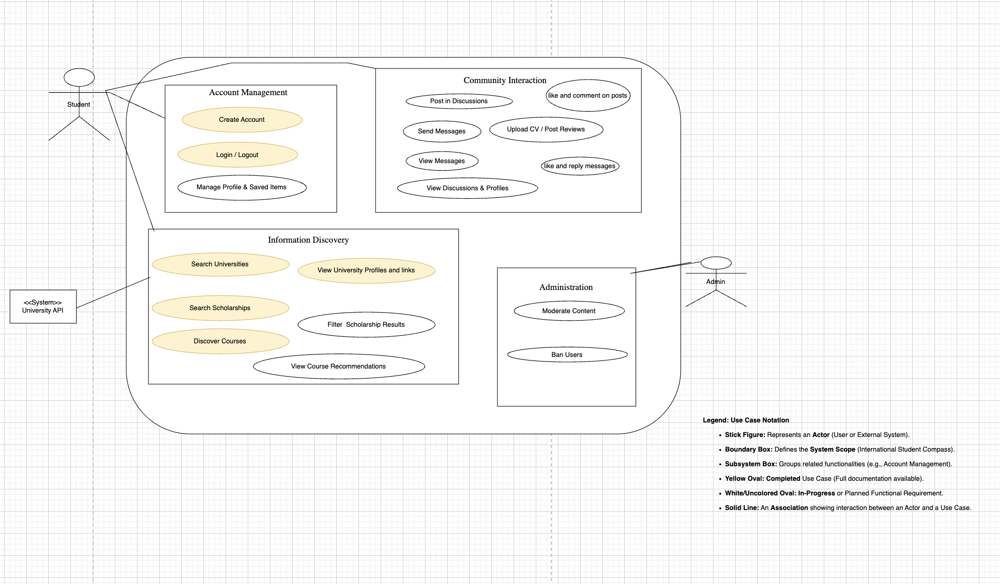
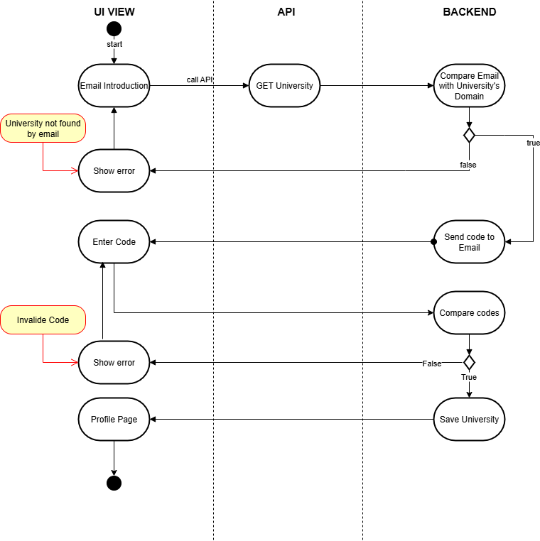
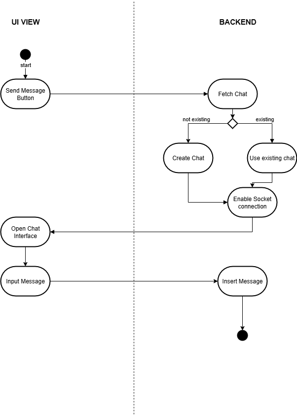
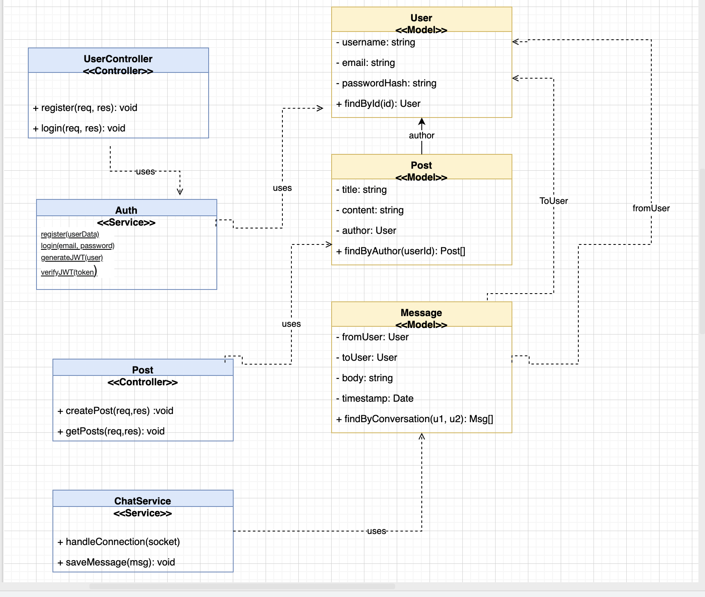
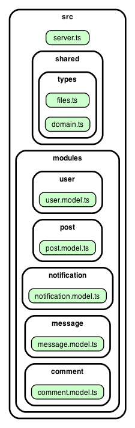
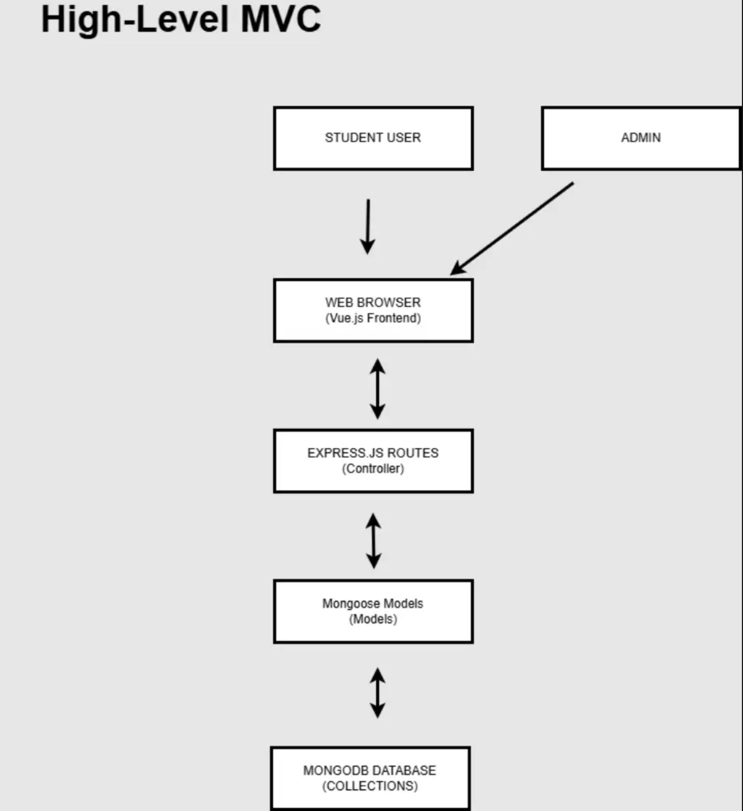
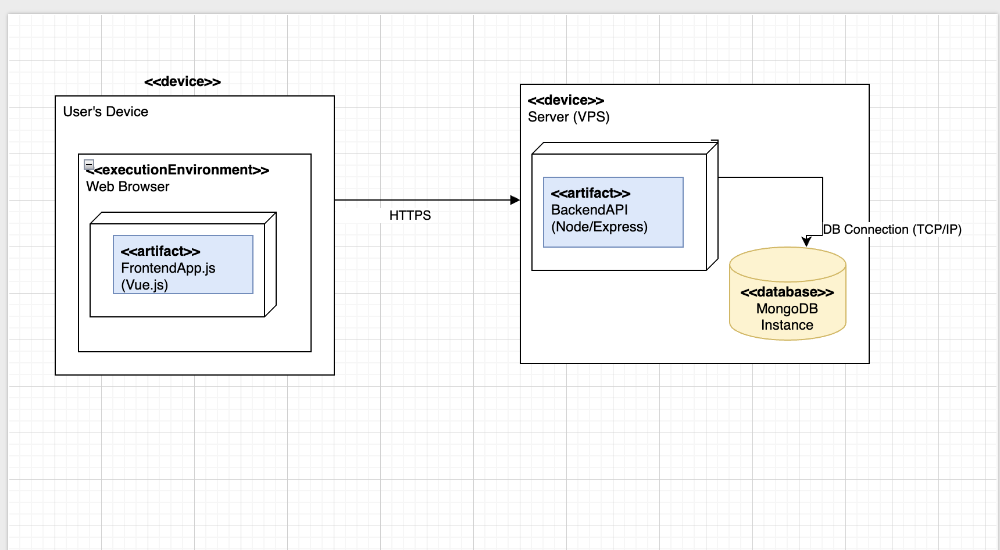

# Software Architecture Document (SAD)
*(Based on RUP Template)*

## Table of Contents
1.  [Introduction](#1-introduction)
    * [1.1 Purpose](#11-purpose)
    * [1.2 Scope](#12-scope)
    * [1.3 Definitions, Acronyms and Abbreviations](#13-definitions-acronyms-and-abbreviations)
    * [1.4 References](#14-references)
    * [1.5 Overview](#15-overview)
2.  [Architectural Representation](#2-architectural-representation)
3.  [Architectural Goals and Constraints](#3-architectural-goals-and-constraints)
4.  [Use-Case View](#4-use-case-view)
    * [4.1 Use-Case Realizations](#41-use-case-realizations)
5.  [Logical View](#5-logical-view)
6.  [System Interconnectivity](#6-system-interconnectivity)
    * [5.1 Overview](#51-overview)
    * [5.2 Architecturally Significant Design Packages](#52-architecturally-significant-design-packages)
6.  [Process View](#6-process-view)
7.  [Deployment View](#7-deployment-view)
8.  [Implementation View](#8-implementation-view)
    * [8.1 Overview](#81-overview)
    * [8.2 Layers](#82-layers)
9.  [Data View](#9-data-view)
10. [Size and Performance](#10-size-and-performance)
11. [Quality](#11-quality)
---

-----

## 1\. Introduction

### 1.1 Purpose

This document provides a comprehensive architectural overview of the "International Student Compass" system. It is intended to capture and convey the significant architectural decisions made, using a number of different architectural views (Logical, Deployment, Data) to depict different aspects of the system.

### 1.2 Scope

This document describes the architecture of the "International Student Compass" web application. This includes the decoupled frontend client, the backend API server, the database, and the interfaces between them. The requirements for this architecture are defined in the project's Software Requirements Specification (SRS).

### 1.3 Definitions, Acronyms and Abbreviations

| Abbreviation | Explanation |
| :--- | :--- |
| **SAD** | Software Architecture Document |
| **SRS** | Software Requirements Specification |
| **RUP** | Rational Unified Process |
| **API** | Application Programming Interface |
| **ERD** | Entity-Relationship Diagram |
| **UML** | Unified Modeling Language |
| **DB** | Database |

### 1.4 References
 * International Student Compass - Software Requirements Specification (SRS)
* International Student Compass - Project Blog: https://education4849.wordpress.com/
*Project GitHub Repository: https://github.com/bennixm/students-platform

### 1.5 Overview

This document is organized based on the RUP architecture template.

  * **Section 2 & 3** describe the overall architectural goals and constraints.
  * **Section 4 (Use-Case View)** shows the key user interactions the system must support.
  * **Section 5 (Logical View)** details  the system's class structure.
  * **Section 6 (Process View)** illustrates the flow of a typical user request.
  * **Section 7 (Deployment View)** shows the server/client hardware configuration.
  * **Section 8 (Implementation View)** lists the technologies and layers.
  * **Section 9 (Data View)** provides the database model.

-----

## 2\. Architectural Representation

This document uses several architectural views to describe the system.

  * The **Logical View** (Section 5) is used to describe the system's structure, primarily through the  3-Tier Architecture.
  * The **Use-Case View** (Section 4) shows the high-level user requirements that the architecture must satisfy.
  * The **Process View** (Section 6) illustrates the dynamic behavior and flow of data.
  * The **Deployment View** (Section 7) shows the physical client-server architecture.
  * The **Data View** (Section 9) describes the persistent database structure.

-----
## 2.5 Model–View–Controller (MVC)

## Overview
Our platform follows the **Model–View–Controller (MVC)** architecture pattern using **Vue 3** for the frontend (View) and **Express.js** for the backend (Controller).  
The **Model** layer is implemented with **Mongoose** and **MongoDB** for handling data storage and business logic.  
This separation ensures a clean structure, easier debugging, and improved scalability.

---

##  2.1 Security and Responsibilities

- **View (Vue)** – Client-side validation, routing, and UX; never stores sensitive data.
- **Controller (Express)** – Handles authentication, authorization, validation, and error responses.
- **Model (Mongoose)** – Maintains schema validation, indexes, and data integrity.

---

## 2.2 MVC Tool

Our chosen technology stack directly supports the MVC architecture.
- **Vue 3** implements the **View** layer, providing a reactive user interface for the frontend.
- **Express.js** serves as the **Controller**, managing API routes, handling user requests, and connecting the frontend with the backend logic.
- **Mongoose with MongoDB** form the **Model** layer, defining schemas, managing validation, and storing data persistently.

This combination enforces a clean separation between presentation, logic, and data, ensuring scalability and maintainability.

## 2.5 Model–View–Controller (MVC)

## Overview
Our platform follows the **Model–View–Controller (MVC)** architecture pattern using **Vue 3** for the frontend (View) and **Express.js** for the backend (Controller).  
The **Model** layer is implemented with **Mongoose** and **MongoDB** for handling data storage and business logic.  
This separation ensures a clean structure, easier debugging, and improved scalability.

---

## Security and Responsibilities

- **View (Vue)** – Client-side validation, routing, and UX; never stores sensitive data.
- **Controller (Express)** – Handles authentication, authorization, validation, and error responses.
- **Model (Mongoose)** – Maintains schema validation, indexes, and data integrity.

---

## 2.6 MVC Tool

Our chosen technology stack directly supports the MVC architecture.
- **Vue 3** implements the **View** layer, providing a reactive user interface for the frontend.
- **Express.js** serves as the **Controller**, managing API routes, handling user requests, and connecting the frontend with the backend logic.
- **Mongoose with MongoDB** form the **Model** layer, defining schemas, managing validation, and storing data persistently.

This combination enforces a clean separation between presentation, logic, and data, ensuring scalability and maintainability.

## 3\. Architectural Goals and Constraints

The primary architectural goal is to create a **decoupled, scalable, and maintainable** system. The architecture is constrained by the following decisions:

  * The system **must** be built as a web application.
  * The architecture **must** be decoupled, with a separate frontend (Vue.js) and backend (Node.js/Express) communicating via a RESTful API.
  * The system **must** support real-time chat functionality.
  * The system **must** be deployable on virtual private servers (VPS).
  * The system **must** be fully functional on the latest stable versions of Chrome, Firefox, Safari, and Edge.

# 3.1 Architectural Goals & Constraints
Constraint: The system must be accessible to international students in regions with varying hardware standards. The architecture must prioritize a "Web-First" approach to ensure functionality on low-spec devices or browsers where native mobile apps are not an option.
-----

## 4\. Use-Case View

This view is illustrated by the Overall Use Case Diagram from the SRS, which shows the high-level interactions between the actors (Guest, Student, Admin) and the system.

These diagrams show the step-by-step flow for a specific use case. They help explain the detailed logic from start to finish.

Activity Diagram 1: (e.g., Student Search for University) 

Activity Diagram 2: (e.g., Student Posting in a Discussion) 

## 5\. Logical View

### 5.1 Overview

The design model is decomposed into a **Layered Architecture)** pattern.

 ### Presentation Layer (Client): 
 Handled by the Vue.js frontend. It manages user interface logic and communicates with the backend via API calls.

### Application Layer (Server): 
Handled by the Node.js/Express.js backend. It processes business logic and serves as the bridge between the UI and the data.

### Data Layer (Persistence): 
Handled by MongoDB and Mongoose. It defines data schemas and manages persistent storage.

### 5.2 Architecturally Significant Design Packages

This view is represented by our Class Diagrams, which show the modules (packages) and their relationships within the backend.

1.  **Conceptual Class Diagram:**
    
    Link to source : https://drive.google.com/file/d/1iuX_OJVoVvh_0k8iubLss9deJxeDZwXz/view?usp=sharing
2.  **Tool-Generated Class Diagram:**
    
   Link to source :  https://drive.google.com/file/d/1iuX_OJVoVvh_0k8iubLss9deJxeDZwXz/view?usp=sharing

-----

## 6\. System Interconnectivity

This view illustrates the dynamic processes within the system. The High-Level Request Flow diagram shows the step-by-step process of a user request, from the client-side View to the server-side Controller and Model, and back again.

Link to source : https://drive.google.com/file/d/1O7Y1TzOtIZfXdbC4Q2rWdp2758wTn7gv/preview

-----

## 7\. Deployment View

This view describes the physical deployment of the system. We use a **Client-Server Architecture**.

  * **Client Node:** The user's web browser, which runs the Vue.js client-side application.
  * **Server Node (VPS):** A dedicated virtual private server that hosts:
    1.  The **Node.js/Express API** (Controller).
    2.  The **MongoDB Database** (Model).
  * **Interconnection:** The Client and Server communicate over the internet via the **HTTP/S protocol** (for REST API calls) and **WebSockets** (for real-time chat).
Link to source : https://drive.google.com/file/d/1iuX_OJVoVvh_0k8iubLss9deJxeDZwXz/view?usp=sharing

-----

## 8\. Implementation View

### 8.1 Overview

Communication between the Client and Server is strictly handled via a RESTful API. This allows the backend to be "front-end agnostic," meaning the server could support a mobile app in the future without changing its core logic.

### 8.2 Layers

**1. Client Layer (View)**

  * **Description:** The user-facing frontend built in Vue.js.
  * **Technologies:** Vue.js, Tailwind CSS, Axios.

**2. Server Layer (Controller & Model)**

  * **Description:** The backend API and database.
  * **Technologies:** Node.js, Express.js, Mongoose, MongoDB, Socket.IO, Elasticsearch.

**Full Technology Stack:**

  * **Frontend:** Vue Js, Tailwind CSS, Axios/Fetch
  * **Backend:** Node.js + Express, JWT/OAuth2, Socket.IO
  * **Database & Search:** MongoDB, Elasticsearch
  * **Hosting:** Dedicated VPS
  * **Tools:** GitHub, Figma, youtrack, Slack/Discord

-----

## 9\. Data View

This view describes the structure of the persistent data, represented by the Entity-Relationship Diagram (ERD) for our MongoDB database.

Link to source : https://app.diagrams.net/#G1CxaKFfJ6WQnAWIj9-s9FSWNXsZm6ASJx#%7B%22pageId%22%3A%222ljwPO8fNcJzTJ80mE60%22%7D

-----

## 10\. Size and Performance

The architecture must meet the following performance requirements (from the SRS):

  * **Response Time:** Core API endpoints must have a 95th percentile (p95) server-side response time of less than 500ms.
  * **Page Load:** Key pages must achieve a Largest Contentful Paint (LCP) of under 2.5 seconds.
  * **Concurrency:** The system must support 500 concurrent users without performance degradation.
  * **Scalability:** The architecture must be capable of horizontal scaling to support a 50% user-base increase over three months.

-----

## 11\. Quality

The architecture supports the following quality attributes:

  * **Usability:** Platform Support: The system is a Web-based application. This choice is a design constraint to ensure students without high-end smartphones or specific OS versions (iOS/Android) can still access the service via any standard mobile or desktop browser.
  * **Reliability:** The system will have a minimum uptime of 99.5%, with automated daily backups (24-hour RPO) and a 4-hour Recovery Time Objective (RTO).
  * **Supportability:** The code will follow clean code standards. High test coverage will ensure new changes do not break existing functionality.
