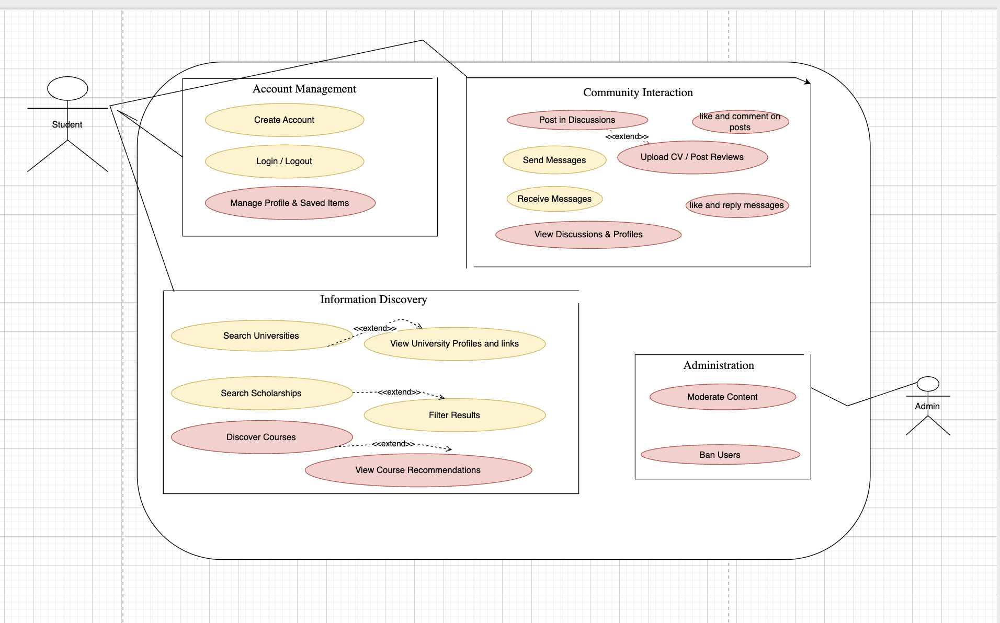

# International Student Compass - Software Requirements Specification 

## Table of contents
- [Table of contents](#table-of-contents)
- [Introduction](#1-introduction)
    - [Purpose](#11-purpose)
    - [Scope](#12-scope)
    - [Definitions, Acronyms and Abbreviations](#13-definitions-acronyms-and-abbreviations)
    - [References](#14-references)
    - [Overview](#15-overview)
- [Overall Description](#2-overall-description)
    - [Vision](#21-vision)
    - [Use Case Diagram](#22-use-case-diagram)
	- [Technology Stack](#23-technology-stack)
- [Specific Requirements](#3-specific-requirements)
    - [Functionality](#31-functionality)
    - [Usability](#32-usability)
    - [Reliability](#33-reliability)
    - [Performance](#34-performance)
    - [Supportability](#35-supportability)
    - [Design Constraints](#36-design-constraints)
    - [Online User Documentation and Help System Requirements](#37-on-line-user-documentation-and-help-system-requirements)
    - [Purchased Components](#purchased-components)
    - [Interfaces](#39-interfaces)
    - [Licensing Requirements](#310-licensing-requirements)
    - [Legal, Copyright And Other Notices](#311-legal-copyright-and-other-notices)
    - [Applicable Standards](#312-applicable-standards)
- [Supporting Information](#4-supporting-information)

## 1. Introduction

### 1.1 Purpose
This Software Requirements Specification (SRS) describes all specifications for the application "International student compass". It includes an overview about this project and its vision, detailed information about the planned features and boundary conditions of the development process.

### 1.2 Scope
The project is going to be realized as a web app.  
  

  
Planned Subsystems are: 
* University & Scholarship Discovery: The core search engine for finding universities and filtered scholarships.
* Account & Profile System: Allows students to create accounts and build personal profiles.
* Community Enrichment: Enables students to post their cvs and make community posts.
* Peer-to-Peer Chat: A direct messaging system for students to connect and communicate.
* Online Course Curation: A section for discovering recommended online courses from other platforms.
* Data Storage: The underlying cloud-based database that manages all platform data.

### 1.3 Definitions, Acronyms and Abbreviations
| Abbrevation | Explanation                            |
| ----------- | -------------------------------------- |
| SRS         | Software Requirements Specification    |
| UC          | Use Case                               |
| n/a         | not applicable                         |
| tbd         | to be determined                       |
| UCD         | overall Use Case Diagram               |
| FAQ         | Frequently asked Questions             |

### 1.4 References

| Title                                                              | Date       | Publishing organization   |
| -------------------------------------------------------------------|:----------:| ------------------------- |
| [Common Playground Blog](https://education4849.wordpress.com/)    | 25.09.2025 | International Student Compass    |
| [GitHub](https://github.com/bennixm/students-platform)            | 25.09.2025 | International Student Compass    |

### 1.5 Overview
The following chapter provides an overview of this project with vision and Overall Use Case Diagram. The third chapter (Requirements Specification) delivers more details about the specific requirements in terms of functionality, usability and design parameters. Finally there is a chapter with supporting information. 
    
## 2. Overall Description

### 2.1 Vision
To create the one app every student needs to make their dream of studying abroad a reality,making the entire process simple, exciting, and less lonely.

The Problem We’re Fixing
Right now, figuring out how to study in another country is a mess. Students have to search dozens of confusing websites, forums, and social media groups. They don’t know who to trust, the information is scattered everywhere, and it feels like you’re doing it all by yourself. It’s stressful and makes people give up.

What We’re Building
We are building one simple place for everything you need:

A Student Community: A friendly place to connect with students from all over the world. You can ask for real, honest advice from people who have already done it, and make friends before you even arrive in your new country.
Easy Search Tools: Find the perfect university and scholarships without the headache. No more opening 50 browser tabs. We’ll put everything you need to know in one clean, easy-to-search list.
Real Tips & Help: A library full of helpful short videos, guides, and advice from current international students. Learn everything from “how to pack” to “how to open a bank account.”

### 2.2 N/A

### 2.3 Technology Stack
Technologies we plan to use
Frontend

Vue Js
Tailwind CSS (styling)
Axios/Fetch for API calls
Backend

Server: Node.js + Express  / FastAPI
Auth: JWT and OAuth2
Realtime: Socket.IO (chat, forums)
Database & Search

Primary DB: MongoDB(structured data: users, universities, scholarships)
Search: Elasticsearch (for fast filtering of scholarships/universities)

Hosting:

Frontend: dedicated vps
Backend: dedicated vps
DB: mongo db

Collaboration:
GitHub (branches: frontend, backend, db)
Figma (Petra + Benni for UI flow)
youtrack (Petra for tasks)

Other Tools

Version Control: GitHub / GitLab
Design: Figma (UI/UX)
Communication: Slack / Discord
Project Management : youtrack

## 2.4 Actors

Actors represent the roles that interact with the system. For the International Student Compass, we have identified three primary human actors and one system actor.

1. Guest

A Guest is any individual who visits the web application without an account or without being logged in. Their interaction is limited to discovery and browsing.

Primary Goals:

To explore the platform's offerings without commitment.

To find basic information about universities.

Key Capabilities:

Search for universities by name or country.

View public university profile pages.

Read community discussions in a read-only mode.

2. Student (Authenticated User)

The Student is the primary actor of the platform. This is a user who has successfully registered an account and is logged in. They have full access to all community and personalization features.

Primary Goals:

To connect with other students and seek advice.

To personalize their search and save information for future reference.

To contribute to the community's knowledge base.

Key Capabilities:

All capabilities of a Guest.

Create and manage their personal profile.

Post new threads and replies in university discussions.

Initiate one-on-one chats with other students.

Save or bookmark universities, scholarships, and courses.

Submit reviews, ratings, and photos for university profiles.

3. Administrator

An Administrator is a privileged user with the responsibility of managing the platform, ensuring content quality, and enforcing community guidelines.

Primary Goals:

To maintain a safe and constructive community environment.

To manage the platform's user base and content.

Key Capabilities:

All capabilities of a Student.

Access a dedicated administrative dashboard.

Moderate user-generated content (delete posts, reviews, photos).

Manage user accounts (suspend or ban users).

Review content flagged by the community through the reporting system.

## 2.5 Model–View–Controller (MVC)

## Overview
Our platform follows the **Model–View–Controller (MVC)** architecture pattern using **Vue 3** for the frontend (View) and **Express.js** for the backend (Controller).  
The **Model** layer is implemented with **Mongoose** and **MongoDB** for handling data storage and business logic.  
This separation ensures a clean structure, easier debugging, and improved scalability.

---

## Roles

### View (Vue 3 SPA)
- Renders pages, forms, lists, and the chat interface.
- Manages client-side routing and application state.
- Sends requests to the Express API via **Axios** or **Fetch**.
- Handles user interactions and updates the UI dynamically.
- Does **not** access the database directly.

### Controller (Express.js)
- Defines RESTful endpoints and WebSocket connections.
- Validates incoming data and performs authentication/authorization.
- Orchestrates logic by interacting with Models.
- Formats responses as JSON for the frontend.
- Applies middleware for security (rate limiting, sanitization, etc.).

### Model (Mongoose + MongoDB)
- Defines data schemas, relationships, and validation rules.
- Encapsulates all database operations.
- Implements domain rules (e.g., a user can have only one CV).
- Handles queries, indexing, and data consistency.

---

## Request Lifecycle (Example)

1. A **user** performs an action in Vue (e.g., *Search Universities*, *Upload CV*, *Send Message*).
2. Vue sends an HTTP request to the **Express** backend.
3. The **Controller** validates input, authorizes the user, and calls the appropriate **Model** function.
4. The **Model** interacts with the database and returns results.
5. The **Controller** sends a structured JSON response.
6. The **View** updates the interface to reflect the change.

---

## Security and Responsibilities

- **View (Vue)** – Client-side validation, routing, and UX; never stores sensitive data.
- **Controller (Express)** – Handles authentication, authorization, validation, and error responses.
- **Model (Mongoose)** – Maintains schema validation, indexes, and data integrity.

---

## 2.6 MVC Tool

Our chosen technology stack directly supports the MVC architecture.
- **Vue 3** implements the **View** layer, providing a reactive user interface for the frontend.
- **Express.js** serves as the **Controller**, managing API routes, handling user requests, and connecting the frontend with the backend logic.
- **Mongoose with MongoDB** form the **Model** layer, defining schemas, managing validation, and storing data persistently.

This combination enforces a clean separation between presentation, logic, and data, ensuring scalability and maintainability.

## 3. Specific Requirements

### 3.1 Functionality
Until December 2025 (Core MVP Launch)

#### 3.1.1 Creating an Account:
 Users can sign up with an email and password to create a personal profile.
 The sign-up form will require the user's Full Name, Email Address, and a Password.
 Password creation will enforce a minimum length of 8 characters.
Upon successful registration, the user will be automatically logged in and prompted to complete their profile. An email verification link will be sent to their registered email address.

#### 3.1.2 Logging In & Out:
 Registered users can log in to access all features and log out for privacy.
 A "Forgot Password" feature will allow users to initiate a password reset process via email.

#### 3.1.3 Searching for Universities: 
Users can search for universities by name or country and view a list of results showing the university's name and official website.Clicking a result will navigate the user to that university's dedicated profile page. A message will indicate when a search yields no results.

#### 3.1.4 Viewing Discussions & Profiles:
 Users can browse community discussion spaces for specific universities and view the profiles of other students.
 Users can view the public profiles of other students, which will display their full name, profile picture, university, and field of study.

#### 3.1.5 Posting in Discussions:
 Logged-in users can post questions and replies within the university community discussion spaces.

#### 3.1.6 Communicating via Chat:
 Users can initiate a one-on-one chat with another student to ask for advice and send real-time text messages.

Until Summer 2026 (Post-Launch Expansion)
#### 3.1.7 Finding Scholarships:
 A powerful search engine allowing users to find scholarships with detailed filters (e.g., Country, Nationality, Field of Study).

#### 3.1.8 Enriching University Profiles:
 Users can add value to the platform by posting reviews, star ratings, and photos on the university profile pages.

#### 3.1.9 Discovering Online Courses:
 A curated section to help students find relevant online courses for language skills, test prep, and academic writing.
  Each course listing will show its title, provider (e.g., Coursera), a description, and a link to the external course page.

#### 3.1.10 Managing Your Profile & Saved Items:
 Users will be able to save favorite universities, scholarships, and courses to their personal profile for later reference.
 A dedicated dashboard within the user's profile will allow them to easily access and manage their saved items.
  Users can edit their profile information, including their name, picture, and academic details.

#### 3.1.11 Admin Content Moderation: 
Admins will have tools to manage the community by removing inappropriate content and banning users who violate guidelines.
Admins can view, edit, or delete any user-generated content (posts, reviews, photos).
Admins can suspend or permanently ban users who violate community guidelines.

### 3.2 Usability
We plan on designing the user interface as intuitive and self-explanatory as possible to make the user feel as comfortable as possible using the webapp. Though an FAQ document will be available, it should not be necessary to use it.

#### 3.2.1 No training time needed
Our goal is that opens the app and is able to use all features without any explanation or help.

#### 3.2.2 Familiar Feeling
Our design philosophy is simple: Don't reinvent the wheel. The app should look and feel like the apps our users already use every day. This will make it feel intuitive from the moment they open it.

### 3.3 Reliability
This section defines the system's ability to maintain its level of performance under stated conditions for a stated period.

#### 3.3.1 Availability
The application shall have a minimum uptime of 99.5%, measured on a monthly basis. This corresponds to a maximum of 3.65 hours of unplanned downtime per month. Scheduled maintenance windows will be planned during periods of lowest user activity (e.g., 02:00-04:00 CET) and will be announced to users at least 48 hours in advance.

#### Data Integrity and Recovery

The system must ensure zero data loss of critical user-generated content (e.g., profiles, community posts, chat messages) in the event of a non-catastrophic system failure.

Backups: Automated daily backups of the primary database are required.

Recovery Point Objective (RPO): The maximum acceptable data loss in a disaster scenario is 24 hours.

Recovery Time Objective (RTO): In the event of a system failure, critical services must be restored within 4 hours.

### 3.4 Perfomance
This section specifies the performance characteristics of the software under various workloads.

#### 3.4.1  Response Time
To ensure a fluid user experience, the system must meet the following response time targets under typical load conditions:

API Performance: Core API endpoints (e.g., user authentication, fetching university data, posting a message) must have a 95th percentile (p95) server-side response time of less than 500ms.

Page Load: Key user-facing pages (Home Dashboard, Search Results Page) must achieve a Largest Contentful Paint (LCP) of under 2.5 seconds on a standard broadband connection.

#### 3.4.2 Storage 
We are aiming to keep the needed storage as small as possible.
The system must be able to support 500 concurrent users performing standard read-and-write operations (e.g., searching, posting, and chatting) without degradation of the response times specified above.

#### 3.4.3 App perfomance / Response time
To provide the best  perfomance we aim to keep the response time as low as possible. This will make the user experience much better.
The system's architecture must be designed to scale horizontally to accommodate user growth. It should be capable of handling a 50% increase in the user base over a three-month period without requiring significant architectural changes.

### 3.5 Supportability

#### 3.5.1 Coding Standards
We are going to write the code by using all of the most common clean code standards. For example we will name our variables and methods by their functionalities. This will keep the code easy to read by everyone and make further developement much easier.

#### 3.5.2 Testing Strategy
The application will have a high test coverage and all important functionalities and edge cases should be tested. Further mistakes in the implementation will be discovered instantly and it will be easy to locate the error. 

### 3.6 Design Constraints
This section describes the architectural decisions and constraints that guide the development of the application.

We are building the application using a decoupled, three-tier architecture consisting of a frontend client, a backend application server, and a database. This approach provides a clear separation of concerns and enhances scalability.

Frontend Architecture
We have chosen Vue.js as a design constraint for our frontend development. Its component-based structure is ideal for building a maintainable UI. To achieve strong Search Engine Optimization (SEO)—critical for a platform focused on discovery—we will use the Nuxt.js framework for its Server-Side Rendering (SSR) capabilities.

Backend Architecture
A custom backend using Node.js and Express.js is a core architectural constraint. This decision was made to ensure maximum flexibility, control over our business logic, and the ability to optimize performance specifically for our application's needs. Communication between the frontend and backend will be handled via a RESTful API that we will design and build. This approach allows for long-term scalability and avoids vendor lock-in associated with Backend-as-a-Service (BaaS) platforms.

Supported Platforms
The application is a web app and must be fully functional on the latest stable versions of modern web browsers:

Google Chrome

Mozilla Firefox

Apple Safari

Microsoft Edge

### 3.7 On-line User Documentation and Help System Requirements
The usage of the app should be as intuitive as possible so it won't need any further documentation. If the user needs some help we will implement a "Help"-Button on the web which includes a FAQ and a formular to contact the developement team.

### 3.8 Purchased Components
We don't have any purchased components yet. If there will be purchased components in the future we will list them here.

### 3.9 Interfaces

#### 3.9.1 User Interfaces
The User Interfaces that will be implemented are:

Home Dashboard - Acts as a personalized starting point, showing recommended scholarships, trending discussions, and relevant online courses.

University Search Page - Allows users to search for universities by country or name and displays the results in a clear list.

University Profile Page - Shows detailed, community-enriched information about a specific university, including student reviews, photos, and a link to its dedicated discussion space.

Scholarship Search Page - A powerful search tool with detailed filters to help students find relevant funding opportunities.

Online Courses Page - A curated discovery page for finding relevant online courses, with filters for price and skill level.

Chat & Conversation Pages - Includes the main chat inbox listing all conversations, and the individual chat screen for sending and receiving messages.

User Profile Page - Displays a user's public information (e.g., their university, field of study) and their contributions to the community, like their reviews.

Login & Register Pages - Provides the standard forms for user authentication (Sign Up, Log In, Password Reset).

Settings Page - Allows users to manage their account details, notification preferences, and privacy settings.

#### 3.9.2 Hardware Interfaces
(n/a)

#### 3.9.3 Software Interfaces
The application is a web app and does not require a specific operating system. The primary software interface for the end-user is a modern web browser. The platform will officially support the latest versions of:

Google Chrome

Mozilla Firefox

Apple Safari

Microsoft Edge

#### 3.9.4 Communication Interfaces
The server and hardware will communicate using the http protocol. 

### 3.10 Licensing Requirements

### 3.11 Legal, Copyright, and Other Notices
The logo is licensed to the International student  Team and is only allowed to use for the application. We do not take responsibilty for any incorrect data or errors in the application.

### 3.12 Applicable Standards
The development will follow the common clean code standards and naming conventions. Also we will create a definition of d which will be added here as soon as its complete.

## 4. System Architecture

### 4.1 Architectural Pattern Explanation
Our application follows a decoupled architecture, separating the frontend client (running in the user's browser) from the backend API server. While not a strict, traditional Model-View-Controller (MVC) pattern, especially on the backend, the components map conceptually as follows:

View: Handled by the Vue.js frontend application. This layer is responsible for rendering the user interface, displaying data, and capturing user interactions.

Controller: Primarily handled by the Node.js/Express.js backend API. This layer receives incoming HTTP requests from the frontend, executes the relevant business logic (often by calling service functions), interacts with the Model layer to fetch or save data, and formulates the HTTP response to send back to the client.

Model: This layer is represented by our Mongoose schemas and models, which define the structure and validation rules for our data, and handle all interactions with the MongoDB database (Create, Read, Update, Delete operations).

### 4.2 Technology Mapping to Pattern 
The specific technologies implementing the layers described above are:

View: Vue.js (potentially using the Nuxt.js framework)

Controller: Express.js (running on the Node.js runtime)

Model: Mongoose ODM (Object Data Modeling library for MongoDB)
### 4.3 Overall Use Case Diagram 

- yellow: Planned till end of november
- red: Planned till end of may

### 4.4 Section 5  "N/A" 

### 4.5 High-Level Request Flow Diagram .
This diagram illustrates the typical sequence of events when a user interacts with the frontend, triggering a request to the backend API and database.

<iframe src="https://drive.google.com/file/d/1O7Y1TzOtIZfXdbC4Q2rWdp2758wTn7gv/preview" width="640" height="480" allow="autoplay"></iframe>

### 4.6 Backend Class Diagram .

This UML Class Diagram provides a simplified view of the major modules and classes within our Node.js/Express backend, highlighting the conceptual separation between Controller logic (handling routes and requests) and Model logic (handling data).

### 4.7 Section 6 "N/A"

### 4.8 Deployment Diagram 
This UML Deployment Diagram illustrates the physical or virtual nodes where our application components are deployed and the communication paths between them.
https://app.diagrams.net/#G1iuX_OJVoVvh_0k8iubLss9deJxeDZwXz#%7B%22pageId%22%3A%22diagram1%22%7D

### 4.9 Section 8 "N/A" .

### 4.10 Database Model (ERD) ).
This Entity-Relationship Diagram illustrates the main data collections (similar to tables in SQL) within our MongoDB database and the conceptual relationships between them.

### 4.11 Sections 10-11  "N/A" 

### 4.12 Application Architecture
To visualize how our application is structured, we created a Client-Server Architecture diagram. It shows the main components on the **Client Side** (the user's browser running our Vue.js app), the **Server Side** (our Node.js/Express API handling requests and logic), and the **Database** (MongoDB storing our data), along with the communication paths (HTTP/REST, WebSockets, Database Queries) between them.
This diagram gives a clear overview of how the different parts of the International Student Compass work together.

https://drive.google.com/file/d/1wjl8bq1L4v9cO0D2ZRdJ45hv1WFQ2bTi/view

## 5. Supporting Information
For any further information you can contact the International student Team or check our blog (https://wordpress.com/home/education4849.wordpress.com). 
The Team Members are:
- Namuyiga Petra
- Miuta Beniamin
- Miuta Daniel 

