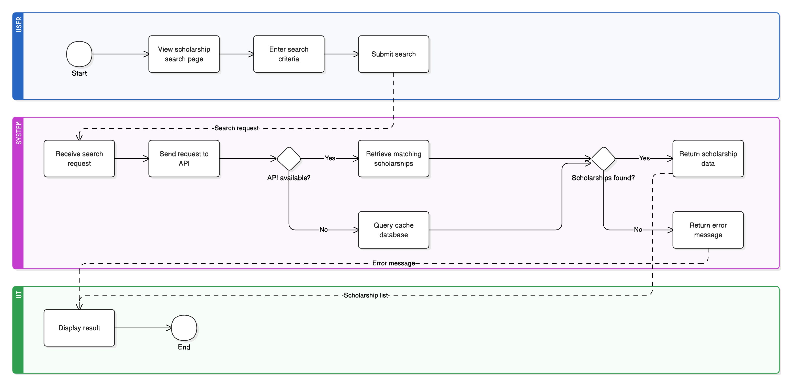

# Use Case: Search Scholarships via API

| Property | Details |
| :--- | :--- |
| **ID** | UC-02 |
| **CRUD Type** | Read |
| **Actors** | Guest, Student |

---

### 1. Description
### 1.1 Brief Description
This use case allows a user to search for scholarships by sending a query to an external API and viewing relevant results such as scholarship name, provider, amount, and deadline.

### 1.2 Detailed Description
A user can search for scholarships globally using an external API integration (e.g., CareerOneStop). By entering keywords such as a field of study, country, or scholarship name, the system retrieves real-time data and displays relevant scholarship opportunities. This enables students to quickly explore available funding options and access key information without leaving the application.

---

## 2. Flow of Events

### Preconditions
* The user has successfully navigated to the "Scholarships" search page.

### Main Flow (Basic Path)
1. The user enters a keyword (e.g., **“Computer Science”** or **“Germany”**) into the search bar.
2. The user clicks the **"Search"** button.
3. The system sends a request to the external Scholarship API with the user’s query.
4. The system receives a successful response from the API.
5. The system displays a list of matching scholarships. Each result includes:
    * Scholarship Name
    * Provider
    * Amount
    * Deadline
    * Description
6. The user reviews the results.

### Alternative Flows (Exceptions)

**5a. No Results Found:**
1. The API returns no matching results.
2. The system displays a message: *“No scholarships found for your query.”*
3. The use case ends.

**3a. API Error / Unavailable:**
1. The system detects a failure in the API request.
2. The system displays an error message: *“Sorry, we couldn’t retrieve scholarship data at the moment. Please try again later.”*
3. The use case ends.

---

## 3. Postconditions
* **Success:** The user is viewing a list of scholarships relevant to their query.
* **Failure:** The user remains on the search page with an appropriate error or no-results message.

---

## 4. Narrative (User Story)

**Feature:** Search for Scholarships  
**As a** Guest or Student  
**I want to** search for scholarships by keyword  
**So that** I can find relevant funding opportunities.

### Scenario: Successful Scholarship Search
* **Given** I am on the "Scholarships" search page
* **When** I enter "Computer Science" in the search bar
* **And** I press the "Search" button
* **Then** I should see a list of scholarships
* **And** each result should display relevant details (name, provider, deadline, etc.)

### Scenario: Search with No Matches
* **Given** I am on the "Scholarships" search page
* **When** I enter "NonExistentScholarship123"
* **And** I press the "Search" button
* **Then** I should see a message: *"No scholarships found for your query"*

---

## 5. CRUD Classification
* **Read:** This is a pure read operation. No data is created, updated, or deleted within the system. The application only retrieves and displays external data.

---

## 6. Activity Diagram

